# 基于 ROS 2 与 Navigation 2 的康养巡检机器人

> 面向康养场景的巡检机器人仿真项目：基于 **ROS 2 Humble** 与 **Navigation 2** 实现多点循环自动巡检、到点语音播报与拍照记录、YOLOv8 视觉感知，以及手机端实时视频监控。项目核心研究工作是在 Nav2 框架下开发一系列 **RRT 变体全局规划器插件**，并完成多场景性能对比与工程优化。

## 目录

- [1. 项目简介](#1-项目简介)
- [2. 功能包总览](#2-功能包总览)
- [3. 环境与依赖安装](#3-环境与依赖安装)
- [4. 快速开始](#4-快速开始)
- [5. 地图构建与 SLAM 扫图](#5-地图构建与-slam-扫图)
- [6. 六自由度机械臂与 MoveIt 运动规划](#6-六自由度机械臂与-moveit-运动规划)
- [7. 自定义导航规划器插件](#7-自定义导航规划器插件)
- [8. 性能对比与测试场景](#8-性能对比与测试场景)
- [9. 工程实践问题与解决方案](#9-工程实践问题与解决方案)
- [10. 致谢与作者](#10-致谢与作者)
- [11. 常见问题](#11-常见问题)

---

## 1. 项目简介

本项目基于 ROS 2 和 Navigation 2 设计了一个康养巡检机器人仿真系统。巡检机器人能够在多个目标点之间循环移动，每到达一个目标点后：

1. 通过语音播放到达的目标点信息；
2. 通过摄像头采集一张实时图像并保存到本地。

系统整体架构（ROS 2 节点关系图）：


---

## 2. 功能包总览

| 功能包 | 功能说明 |
| --- | --- |
| `fishbot_description` | 机器人描述文件与 Gazebo 仿真配置（含 6 个仿真世界、**6-DOF 机械臂**、MoveIt 配置） |
| `fishbot_navigation2` | 机器人导航配置（Nav2 参数、地图文件） |
| `fishbot_application` | 机器人导航应用 Python 代码 |
| `autopatrol_interfaces` | 自动巡检自定义接口（消息/服务定义） |
| `autopatrol_robot` | 自动巡检实现功能包（巡检节点、语音播报） |
| `nav2_custom_planner` | 自定义 RRT 系列导航规划器插件（10 个） |
| `person_control` | 行人巡逻节点（模拟动态障碍物） |
| `yolo_ros2_pkg` | YOLOv8 目标检测视觉节点 |

> 说明：本项目工作区路径为 `/home/lrm/BISHE_WS_dsh`，下文所有命令均在 ROS 2 Humble 环境下执行。

---

## 3. 环境与依赖安装

### 3.1 开发平台

| 项目 | 版本 |
| --- | --- |
| 系统 | Ubuntu 22.04 |
| ROS 版本 | ROS 2 Humble |

技术栈：建图采用 slam-toolbox，导航采用 Navigation 2，仿真采用 Gazebo，运动控制采用 ros2_control 实现。

### 3.2 安装依赖

**1. 安装 SLAM 和 Navigation 2**

```bash
sudo apt install ros-$ROS_DISTRO-nav2-bringup ros-$ROS_DISTRO-slam-toolbox
```

**2. 安装仿真相关功能包**

```bash
sudo apt install ros-$ROS_DISTRO-robot-state-publisher ros-$ROS_DISTRO-joint-state-publisher ros-$ROS_DISTRO-gazebo-ros-pkgs ros-$ROS_DISTRO-ros2-controllers ros-$ROS_DISTRO-xacro
```

**3. 安装语音合成和图像相关功能包**

```bash
sudo apt install python3-pip -y
sudo apt install espeak-ng -y
sudo pip3 install espeakng
sudo apt install ros-$ROS_DISTRO-tf-transformations
sudo pip3 install transforms3d
```

---

## 4. 快速开始

> 每个新终端执行 `ros2` 命令前，请先 `source install/setup.bash`。

### 4.1 构建功能包

```bash
cd ~/BISHE_WS_dsh
colcon build
```

### 4.2 运行仿真

```bash
source install/setup.bash
ros2 launch fishbot_description gazebo_sim.launch.py
```

### 4.3 运行导航

```bash
source install/setup.bash
ros2 launch fishbot_navigation2 navigation2.launch.py
```

### 4.4 运行自动巡检

```bash
source install/setup.bash
ros2 launch autopatrol_robot autopatrol.launch.py
```

### 4.5 运行 YOLO 视觉节点

```bash
source install/setup.bash
ros2 run yolo_ros2_pkg yolo_node
```

> 节点首次启动时会自动下载 `yolov8n.pt` 轻量化权重模型。

查看 YOLO 节点的检测输出：

```bash
ros2 run rqt_image_view rqt_image_view
```

在弹出的界面中选择 `/yolo/annotated_image` 话题，即可看到机器人第一视角的实时目标追踪画面。

### 4.6 手机端实时监控（可选）

工作区根目录提供 `server_ros2.py`：一个 FastAPI + ROS 2 混合服务，将小车摄像头画面推送到手机 App，并开放巡检照片的查看与下载接口。

```bash
cd ~/BISHE_WS_dsh
python3 server_ros2.py
```

提供以下 HTTP 接口：

| 接口 | 说明 |
| --- | --- |
| `GET /video_feed` | MJPEG 视频流（网页端） |
| `GET /single_frame` | 单帧图像，供手机 App 定时轮询 |
| `GET /images` | 巡检照片列表（按时间倒序） |
| `GET /images/{filename}` | 查看 / 下载单张照片 |

> 服务默认监听 `10.181.8.38:8000`，照片目录可在 `server_ros2.py` 中通过 `IMAGE_DIR` 修改。

### 4.7 单独调试规划器（排错用）

单独运行 `planner_server` 以排查规划器问题：

```bash
ros2 run nav2_planner planner_server --ros-args \
  --params-file /home/lrm/BISHE_WS_dsh/src/fishbot_navigation2/config/nav2_params.yaml
```

---

## 5. 地图构建与 SLAM 扫图

### 5.1 选择仿真世界

在 `fishbot_description` 的 `gazebo_sim.launch.py` 中修改参数（将要扫图的 `.world` 文件路径替换），例如：

```python
default_gazebo_world_path = os.path.join(urdf_package_path, 'world', 'narrow_corridor.world')
```

内置仿真世界：`custom_room`、`bigger_room`、`bigger_room_without_person`、`bigger_room_complex`、`U_shaped_obstacle`、`narrow_corridor`。

### 5.2 启动仿真并手动扫图

修改完成后编译并启动仿真：

```bash
ros2 launch fishbot_description gazebo_sim.launch.py
```

启动 `fishbot_navigation2` 中的 `slam_rviz.launch.py`，手动操控机器人扫图：

```bash
ros2 launch fishbot_navigation2 slam_rviz.launch.py
```

### 5.3 保存地图

扫图完成后，在保存目录下执行：

```bash
ros2 run nav2_map_server map_saver_cli -f ${文件名}
```

即可生成地图文件（`.pgm` 与 `.yaml`）。将其移动到 `fishbot_navigation2` 的 `maps` 目录下。

### 5.4 配置地图路径

修改 `nav2_params.yaml` 中的地图路径参数：

```yaml
map_server:
  ros__parameters:
    yaml_filename: "/home/lrm/BISHE_WS_dsh/src/fishbot_navigation2/maps/map.yaml"
```

---

## 6. Franka Panda 七自由度机械臂与 MoveIt 运动规划

为巡检小车装配了 **Franka Emika Panda 七自由度机械臂**（开源描述，来自 moveit_resources），支持通过 ros2_control 直接控制，也支持 **MoveIt** 运动规划。

### 6.1 机械臂结构

机械臂为 7 自由度（panda_joint1~7）+ 手爪，臂展 0.855 m，安装在底盘顶部中央。关节限位与惯量均取自官方开源描述：

| 关节 | 名称 | 限位 | 说明 |
| --- | --- | --- | --- |
| 1 | `panda_joint1` | ±170° | 基座旋转 |
| 2 | `panda_joint2` | ±105° | 肩部 |
| 3 | `panda_joint3` | ±170° | 上臂 |
| 4 | `panda_joint4` | -180° ~ +5° | 肘部 |
| 5 | `panda_joint5` | ±170° | 前臂 |
| 6 | `panda_joint6` | -5° ~ +219° | 腕部 |
| 7 | `panda_joint7` | ±170° | 末端旋转 |

Panda 连杆质量 0.63 ~ 4.97 kg（整臂约 18 kg），源文件：`src/panda_description/urdf/panda.urdf.xacro`（含官方完整惯量与动力学参数）。


### 6.2 底盘参数调整

为承载机械臂，底盘体积与质量相应增大，并联动调整了全部相关参数：

| 参数 | 原值 | 新值 |
| --- | --- | --- |
| 底盘形状 | 圆柱 r=0.14 | **长方体 0.70×0.50×0.22 m** |
| 车轮 | 2 轮 + 2 万向轮 | **四轮驱动（r=0.05）** |
| 底盘质量 | 1.0 kg | **8 kg**（承载 Panda） |
| 轮距 / 轴距 | 0.28 / - | **0.48 / 0.40 m** |
| 激光雷达安装位 | 顶部中央 | 后移 x=-0.12（避开机械臂） |
| Nav2 `robot_radius` | 0.12 | **0.35**（长方体对角线） |

### 6.3 直接控制机械臂（ros2_control）

机械臂 7 个关节由 `arm_controller`（`joint_trajectory_controller`）控制，仿真启动时自动加载激活。发送轨迹：

```bash
ros2 action send_goal /arm_controller/follow_joint_trajectory control_msgs/action/FollowJointTrajectory -f "{
  trajectory: {
    joint_names: [panda_joint1, panda_joint2, panda_joint3, panda_joint4, panda_joint5, panda_joint6, panda_joint7],
    points: [{ positions: [0.0, -0.7854, 0.0, -2.3562, 0.0, 1.5708, 0.7854], time_from_start: {sec: 3} }]
  }
}"
```

### 6.4 MoveIt 运动规划

**1. 安装 MoveIt：**

```bash
sudo apt install -y ros-humble-moveit
```

**2. 启动 MoveIt（先启动仿真，再启动 move_group + RViz）：**

```bash
# 终端 1：启动 Gazebo 仿真（见 4.2）
ros2 launch fishbot_description gazebo_sim.launch.py

# 终端 2：启动 MoveIt + RViz 运动规划面板
ros2 launch fishbot_description demo_arm.launch.py
```

**3. 使用方式：**

- 在 RViz 的 MotionPlanning 面板中：设置目标姿态（可拖动末端 / 选择预设姿态 ready / up / wave）→ **Plan** → **Execute**（通过 `arm_controller` 在 Gazebo 中真实执行）；
- 也可用 MoveIt 的 Python 接口（`moveit_commander`）编程控制。

MoveIt 配置文件位于 `src/fishbot_description/moveit/`：`fishbot.srdf`（arm_group 含 7 关节 + 碰撞豁免）、`kinematics.yaml`（KDL 逆解）、`joint_limits.yaml`（Panda 官方限位）、`ompl_planning.yaml`、`moveit_controllers.yaml`（控制器映射到 `arm_controller`）。

---

## 7. 自定义导航规划器插件

### 7.1 插件总览

本项目在 Navigation 2 的基础上实现了 10 个基于 RRT 算法的自定义导航规划器插件（C++，pluginlib 注册），形成一个递进演化的算法家族：

| 插件 | 核心思想 | 源文件 |
| --- | --- | --- |
| `CustomPlanner` | 插件基类与示例实现 | `nav2_custom_planner.cpp` |
| `RRTOriginPlanner` | 最原始的 RRT 算法（含 10% 目标导向采样） | `nav2_rrt_origin_planner.cpp` |
| `RRTDynamicBiasedPlanner` | 动态偏置 RRT：接近目标时采样概率 10% → 40% | `nav2_rrt_dynamic_biased_planner.cpp` |
| `RRTAPFGuidedPlanner` | 人工势场引导：引力 + 斥力合力微调新节点 | `nav2_rrt_apf_guided_planner.cpp` |
| `RRTAdaptivePlanner` | 自适应步长：开阔区大步长、近障碍小步长 | `nav2_rrt_adaptive_step_planner.cpp` |
| `RRTPruningPlanner` | 贪婪剪枝：剔除冗余锯齿点 + 线性插值平滑 | `nav2_rrt_pruning_planner.cpp` |
| `RRTBSplineSmoothPlanner` | 三次 B 样条拟合，生成 C² 连续平滑路径 | `nav2_rrt_bspline_smooth_planner.cpp` |
| `RRTConnectPlanner` | RRT Connect：双向树 + 贪婪扩展（为窄通道而生） | `nav2_rrt_connect_planner.cpp` |
| `RRTConnectSmoothPlanner` | RRT Connect + 路径平滑 | `nav2_rrt_connect_smooth_planner.cpp` |
| `RRTConnectAutoPruningPlanner` | RRT Connect + FSM 自适应剪枝（当前默认启用） | `nav2_rrt_connect_auto_pruning_planner.cpp` |

### 7.2 开发一个新插件

1. **创建插件类**：继承 `nav2_core::GlobalPlanner`，实现其中的纯虚函数：

```cpp
class RRTOriginPlanner : public nav2_core::GlobalPlanner
{
public:
    RRTOriginPlanner() = default;
    ~RRTOriginPlanner() = default;
};
```

2. **编译配置**：在 `CMakeLists.txt` 中添加插件库的编译配置：

```cmake
add_library(${PROJECT_NAME} SHARED ${PROJECT_NAME}.cpp)
```

3. **注册插件**：在 `.cpp` 文件中通过 pluginlib 宏注册：

```cpp
#include "pluginlib/class_list_macros.hpp"
PLUGINLIB_EXPORT_CLASS(nav2_custom_planners::RRTOriginPlanner, nav2_core::GlobalPlanner)
```

4. **启用插件**：在导航参数配置文件 `nav2_params.yaml` 中指定使用的插件（见 6.3）。

### 7.3 切换启用插件

在 `fishbot_navigation2/config/nav2_params.yaml` 中，通过 `planner_plugins` 与 `plugin` 字段切换规划器：

```yaml
planner_server:
  ros__parameters:
    planner_plugins: ["GridBased"]
    GridBased:
      # 经典 A* 算法，适合大多数环境
      # plugin: "nav2_navfn_planner/NavfnPlanner"
      # tolerance: 0.5
      # use_astar: false
      # allow_unknown: true

      # 自定义 RRT 系列
      # plugin: "nav2_custom_planner/CustomPlanner"
      # plugin: "nav2_rrt_origin_planner/RRTOriginPlanner"                # 最原始的RRT算法
      # plugin: "nav2_rrt_dynamic_biased_planner/RRTDynamicBiasedPlanner" # 动态偏置RRT算法
      # plugin: "nav2_rrt_apf_guided_planner/RRTAPFGuidedPlanner"         # APF引导RRT算法
      # plugin: "nav2_rrt_adaptive_step_planner/RRTAdaptiveStepPlanner"   # 自适应步长RRT算法
      # plugin: "nav2_rrt_pruning_planner/RRTPruningPlanner"              # RRT剪枝规划器
      # plugin: "nav2_rrt_bspline_smooth_planner/RRTBSplineSmoothPlanner" # B样条RRT规划器
      # plugin: "nav2_rrt_connect_planner/RRTConnectPlanner"              # RRT Connect规划器（为窄通道而生）
      # plugin: "nav2_rrt_connect_smooth_planner/RRTConnectSmoothPlanner" # RRT Connect平滑规划器
      plugin: "nav2_rrt_connect_auto_pruning_planner/RRTConnectAutoPruningPlanner" # 默认：FSM自适应剪枝
```

> 如果插件注册成功，可在 `~/BISHE_WS_dsh/install/nav2_custom_planner/lib` 目录下查看到插件库文件。

---

## 8. 性能对比与测试场景

### 8.1 房间场景：各插件性能对比

房间的建模：

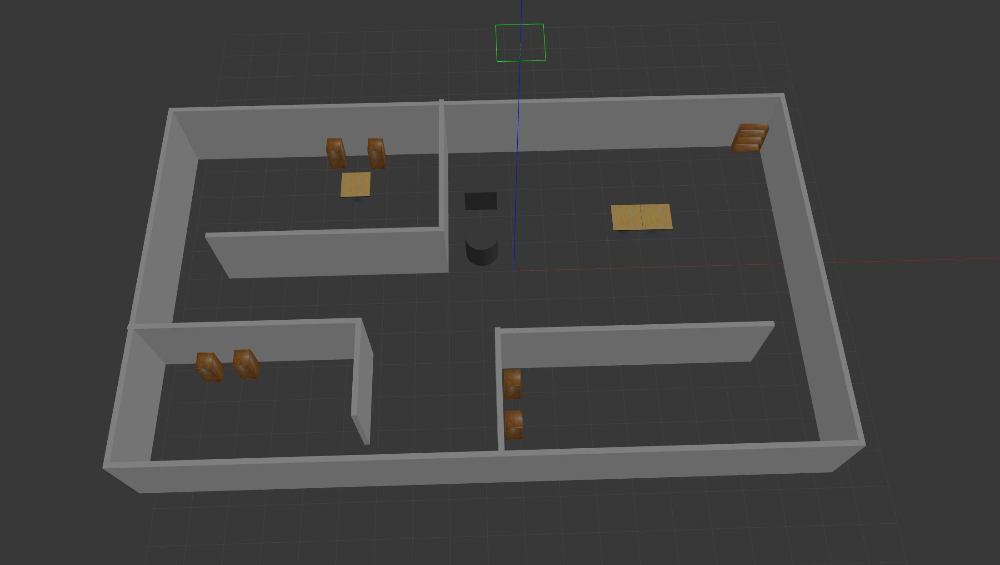

> 测试流程：先运行 Gazebo 仿真环境（`ros2 launch fishbot_description gazebo_sim.launch.py`），再运行导航并收集日志信息（`ros2 launch fishbot_navigation2 navigation2.launch.py > ${插件名}.log`）。

#### 7.1.1 rrt_origin 插件（RVIZ 显示随机树）

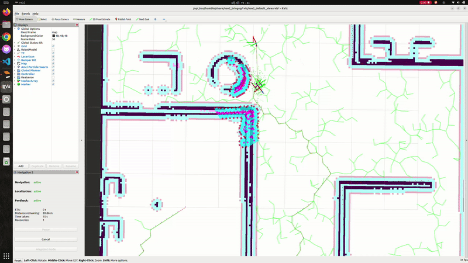

该插件的源码概念图：


> 概念图左侧直观地对比了局部与整体：上方展示了算法如何在单次迭代中，通过在地图中生成随机采样点 `q_rand`，并在现有树中寻找最近节点 `q_near` 后，向该方向延伸固定步长 `step_size` 生成新节点 `q_new`，同时进行关键的碰撞检测；下方则描绘了绿色树枝在障碍物间隙中快速扩散、填充空间的整体过程，并高亮了最终通过 `parent_idx` 回溯得到的紫色有效路径。右侧流程图详细映射了代码的执行步骤，特别强调了代码中包含的 10% 目标导向采样（加速收敛）、基于插值的路径安全性检查，以及利用 `visualization_msgs` 实现的 RVIZ 实时可视化等关键优化技术。

#### 7.1.2 rrt_dynamic_biased 插件（RVIZ 显示随机树）

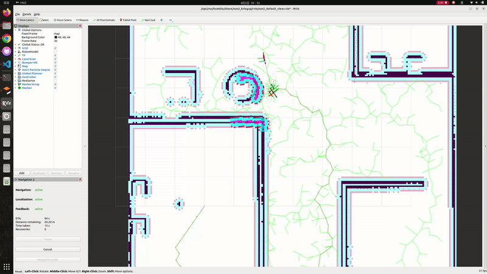

该插件的源码概念图：


> 相比于原版固定 10% 的目标导向概率，新算法引入了动态偏置机制：当树生长到目标点 2.0 m 范围内（`proximity_threshold`）时，会将向目标直接采样的概率从 10%（`p_base`）激增至 40%（`p_close`），产生一种强大的"磁吸效应"来加速收敛；同时，在底层实现上，新代码通过 `tree.reserve()` 预分配内存减少了系统开销，利用距离平方比较（`min_dist_sq`）规避了高耗能的开方计算，并优化了碰撞检测逻辑。这使得算法在迭代次数减少 40%（从 5000 降至 3000）的情况下，依然能以更短的时间和更精准的路径完成规划。

#### 7.1.3 rrt_apf_guided 插件（RVIZ 显示随机树）

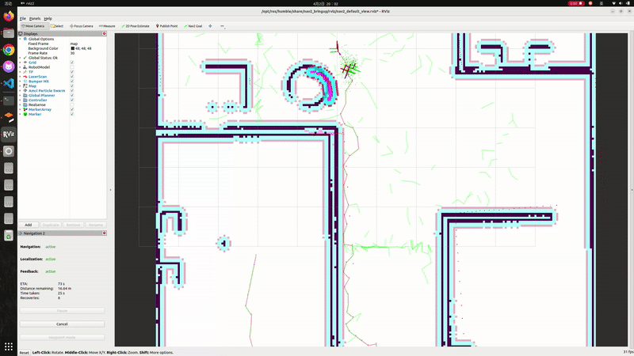

该插件的源码概念图：


> 不同于上一版仅在采样概率上做简单的阶梯式切换，新算法采用了基于距离比例的连续线性偏置函数，使搜索过程更加平滑自然；更核心的差异在于节点生成的逻辑：新代码引入了人工势场（APF），通过计算目标点的引力和局部障碍物的斥力合力，对新节点位置进行实时微调（`nx += 0.1 * fx`），使路径在生长阶段就能主动避开高代价边缘。此外，为了在增加复杂势场计算的同时保持高性能，算法将斥力感知的搜索半径限制在 5 × 5 的极小窗口内，并利用 `constexpr` 常量和预分配内存等手段，确保了在更智能的路径寻优下依然具备极快的响应速度。

#### 7.1.4 rrt_adaptive_step 插件（RVIZ 显示随机树）

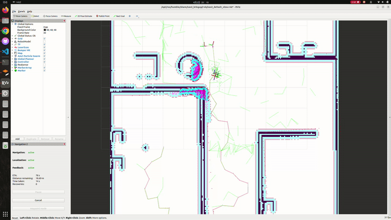

该插件的源码概念图：


> 相较于上一版仅能改变方向的"固定步幅"引导，新算法核心引入了基于代价地图的自适应步长机制：通过 `getCost` 实时感知环境拥挤度，使机器人在开阔区域能以大步长（`s_max`）快速扩张，而在接近障碍物时则自动切换为小步长（`s_min`）进行精细探路。在底层效率上，新版本对势场触发逻辑进行了精简，仅在 `Cost > 50` 的潜在危险区域激活 APF 计算，并配合快速跳跃式连线检测（每 2 个 cell 采样一次），在维持路径高度智能与安全性的同时，显著降低了算法的计算负荷。

#### 7.1.5 rrt_pruning 插件（RVIZ 显示随机树）

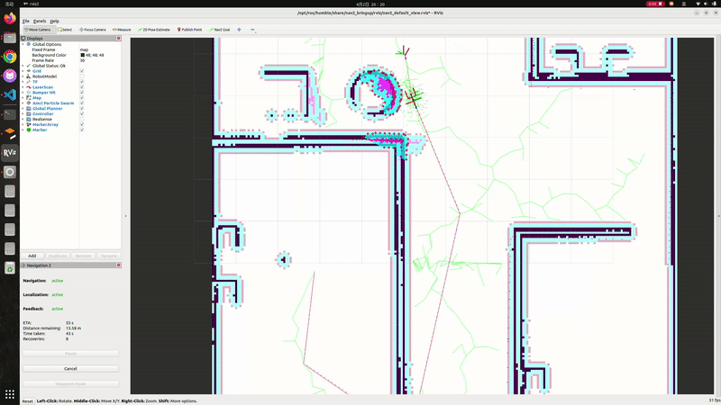

该插件的源码概念图：


> 相较于上一版专注于生长阶段步长自适应的策略，新算法的核心突破在于引入了强大的后期处理优化阶段。它在保留距离敏感动态偏置的基础上，通过**贪婪剪枝逻辑（Greedy Pruning）**主动消除原始 RRT 路径中冗余的"锯齿"点，利用 `isLineClear` 射线检测尝试跨节点直连以寻求几何最短路径；随后，通过 0.1 m 分辨率的线性插值，将剪枝后稀疏的转角点重新转化为分布均匀、利于控制器跟踪的平滑轨迹。这种从"随机折线"到"极简直线段"的进化，配合更稳健的 QoS 通信策略，使得最终生成的路径在保持搜索效率的同时，具备了远超前代的运动平稳性。

#### 7.1.6 rrt_bspline_smooth 插件（RVIZ 显示随机树）

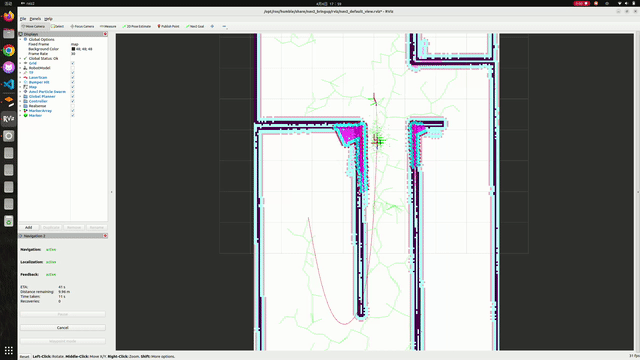

该插件的源码概念图：


> 相比于上一版仅能生成锐利折线的剪枝策略，新算法在保留贪婪剪枝骨干的基础上，引入了三次 B 样条（B-Spline）拟合技术，通过二阶连续的基函数将离散控制点转化为圆润、丝滑的 C² 路径，彻底消除了机器人转弯时的角速度突变。在搜索策略上，它将偏置逻辑从空间敏感转为时间（迭代次数）敏感，使算法在遭遇复杂地形时能随时间推移自动增强探索驱动力；配合首尾重复点的边界约束处理，该规划器在确保路径严格闭合的同时，为底层控制器提供了符合物理惯性且极具动态美感的导航轨迹。

### 8.2 性能数据量化对比

运行性能分析脚本 `log_analyzer.py`（解析日志中的采样节点数与耗时，生成性能对比图）：

```bash
python3 log_analyzer.py
```

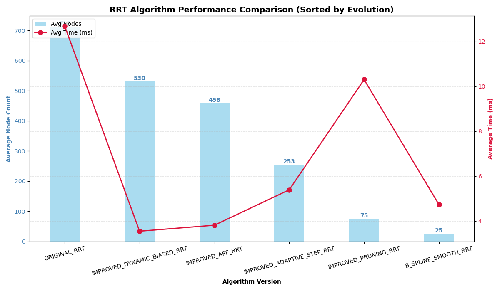

**RRT 算法进化路线小结**：

| 阶段 | 优化手段 | 关键数据 |
| --- | --- | --- |
| 第一步 | 引入动态偏置与人工势场 | 打破原始 RRT 的盲目性，计算耗时从 12.4 ms 骤降至约 4 ms，完成从"无序生长"到"目标引导"的第一步跨越 |
| 第二步 | 自适应步长策略 | 进一步优化空间搜索效率，节点数在保证覆盖的前提下减少了近 45% |
| 第三步 | 路径剪枝与 B 样条平滑 | 将节点数极限压缩至 25 个（降幅达 96.5%），彻底消除路径冗余，实现从"粗糙折线"到"极简平滑曲线"的质变 |

> 这种阶梯式的进化逻辑表明，现代路径规划的优化重心已从单纯的搜索加速，转向了在极小数据规模下构建高质量、符合动力学约束的最优路径。

### 8.3 窄通道场景：与 nav2_navfn_planner 的性能比较

窄通道的建模：

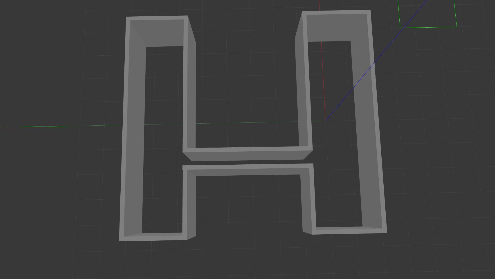

**选择窄通道的理由**：它能直观暴露算法在极低概率空间下的采样效率，验证其在搜索空间受限时是否具备有效的启发式引导，而非盲目在开阔区徘徊；同时，窄通道模拟了机器人实际作业中（比如密集的货架间隙）的高约束环境，是检验算法鲁棒性、搜索完备性以及处理高维复杂约束能力的最具代表性指标。

`nav2_navfn_planner` 在窄通道中的性能表现（Gazebo 仿真）：


`nav2_navfn_planner` 在窄通道中的路径（RVIZ 显示）：

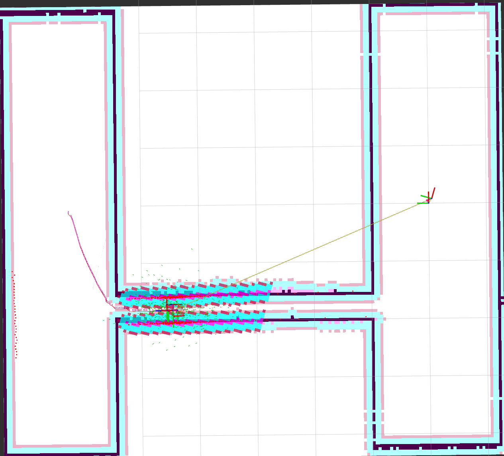

`rrt_connect` 插件在窄通道中的性能表现（Gazebo 仿真）：


`rrt_connect` 在窄通道中的随机树（RVIZ 显示）：

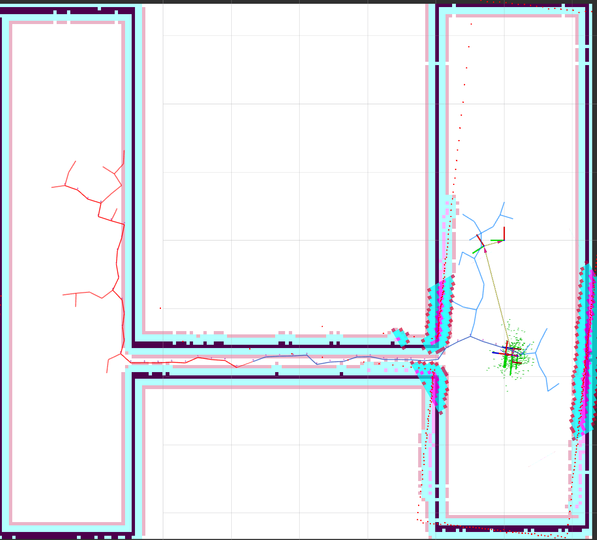

**技术笔记：关于窄通道停顿现象的说明**

在仿真过程中，机器人进入窄通道前出现短暂"停顿"或"犹豫"，通常并非全局规划器（如 RRT-Connect 或 Dijkstra）失效，而是受 Nav2 局部代价地图（Local Costmap）膨胀层的安全机制影响。当通道宽度接近机器人直径时，膨胀层产生的高代价值会导致局部控制器（Controller）为规避碰撞而极度减速；通过优化 `inflation_layer` 的 `cost_scaling_factor` 并调小 `inflation_radius`，可以显著提升机器人在狭窄空间的通过效率。

**技术笔记：为何普通 RRT 无法穿越窄通道**

普通 RRT 就像在迷宫中从起点单向漫游，由于随机采样很难精准落在狭窄入口，导致其极易在开阔区徘徊而无法穿透通道；而 RRT-Connect 采用了"双向奔赴"的策略，从起点和终点同时生长两棵树，并引入了贪婪扩展机制（即发现前方无障碍就连续延伸），这使得两棵树能像拉链一样迅速在狭窄空间内完成对接，极大地提高了穿越窄通道的效率和成功率。

### 8.4 U 型陷阱场景

U 型陷阱的建模：


**选择 U 型陷阱的理由**：选择 U 型陷阱是为了测试算法在**局部最优陷阱**中的"脱困"能力：它利用目标点与陷阱底部的直线距离诱导，检验算法能否识破这种"近在咫尺却不可达"的假象，从而主动向远离目标的区域进行全局搜索；对于轮式小车而言，这更是评估其**非完整性约束处理能力**的关键，考察算法能否在狭窄死胡同内规划出符合转弯半径的调头或倒车路径，从而验证算法在复杂空间布局下的探索完备性与路径逻辑性。

### 8.5 大房间复杂场景

使用 `bigger_room_complex.world`（大房间复杂布局，含多个房间与门道）验证算法在大尺度空间下的规划能力：

Gazebo 仿真场景：

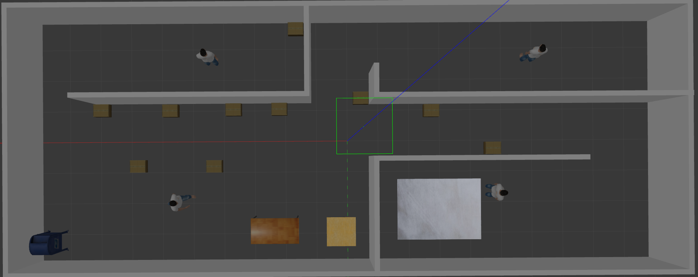

RVIZ 路径显示：

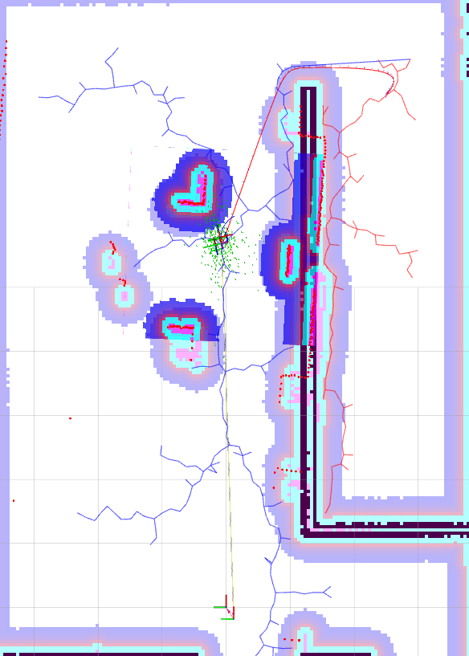

剪枝前后路径对比（大房间）：

| 未剪枝（原始 RRT 锯齿路径） | 剪枝后（极简直线段） | 平滑后（B 样条） |
| --- | --- | --- |
| 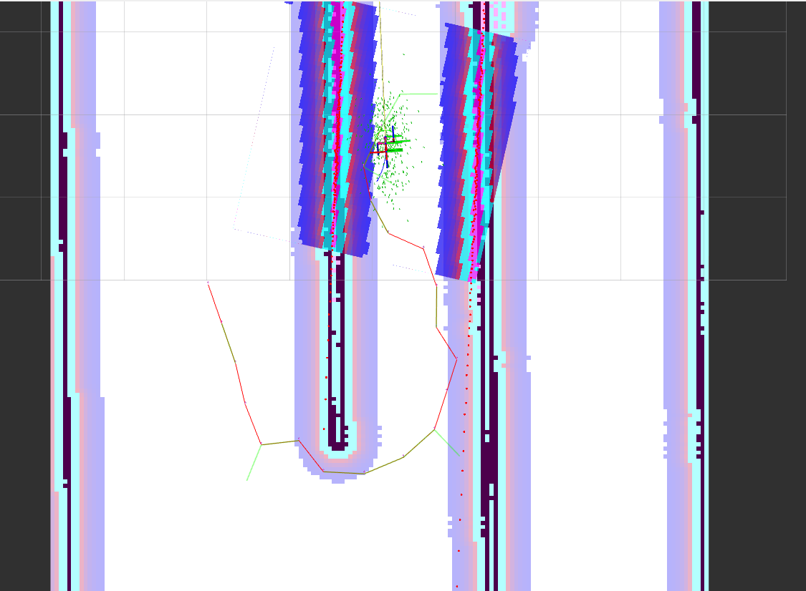 | 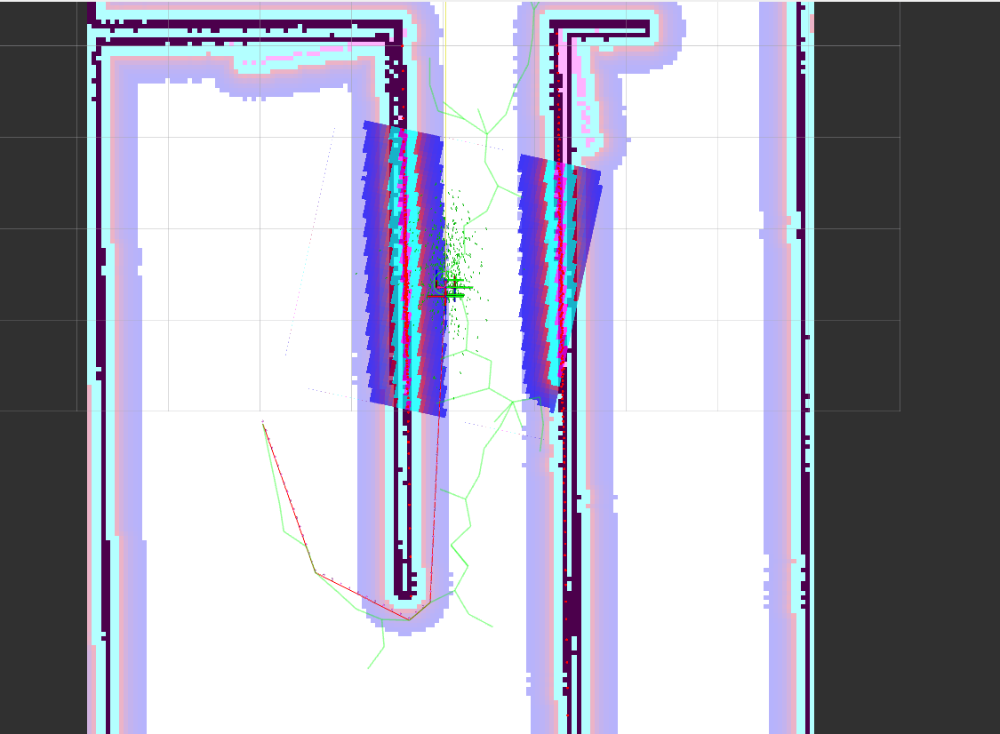 | 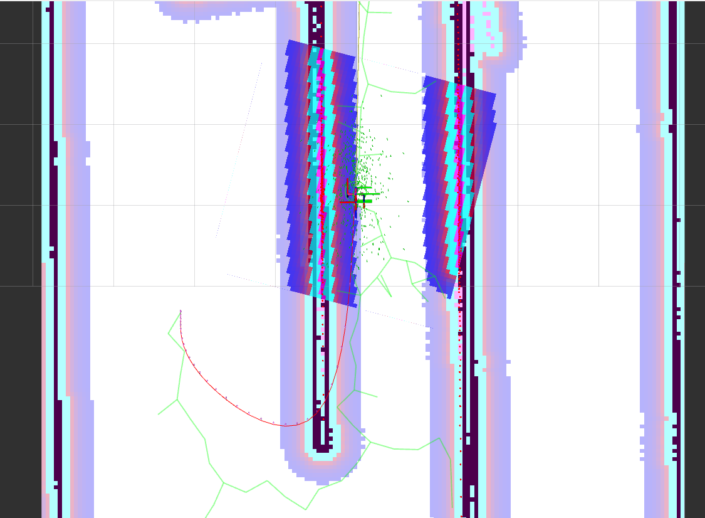 |

> 完整仿真录像见 `bigger_room_complex.mkv`。

---

## 9. 工程实践问题与解决方案

### 9.1 解法一：工程调度干预

在基于 ROS 2 Nav2 框架开发 RRT-Connect 全局规划器时，我们遇到小车在跨越宽阔门道时极限贴边切角，以及在大尺度房间内由于"窄门效应"导致偶发性规划超时的问题。深入排查发现，这源于算法底层的三个核心矛盾：

1. 贪婪剪枝算法追求极短路径与保持安全距离之间的冲突，高代价阈值会纵容危险切角；
2. 若强行降低代价阈值防切角，又会使剪枝高频失效，导致路径退化为原始 RRT 的"之"字形剧烈震荡路线；
3. 全图随机采样配合动态偏置在面对大尺度房间与狭窄房门时，极易陷入无效的撞墙迭代。

鉴于商用移动机器人对路径确定性与安全性的绝对要求，单纯依靠底层算法调参无法完美兼顾平滑直行与居中安全，因此我们最终决定引入业务层的**工程调度干预**。具体方案是在跨越门道等关键拓扑节点处，利用多点导航功能下发途径点（Waypoints）切分规划任务，强制剪枝算法在节点间受限连线。这一方案既彻底根除了越界切角的隐患，又解耦了算法与复杂场景：让全局规划器专注开阔地带的宏观避障，而微观的高精度过门交由确定的空间坐标来保障，实现了运行效率与系统稳定性的最优平衡。

### 9.2 解法二：有限状态机调节

在基于 ROS 2 Nav2 框架开发 `RRTConnectAutoPruningPlanner` 时，我们针对机器人过门贴边切角与开阔地带行进效率的矛盾，设计并实现了一种基于**有限状态机（FSM）的自适应剪枝**方案。

研发过程中我们发现：全局统一的贪婪剪枝会导致算法因追求极短路径而忽略膨胀层风险，造成严重的"贴边"现象；若单纯收紧碰撞阈值，又会使算法在非受限区域退化为原始 RRT 的抖动轨迹。通过日志详尽追踪路径各点的 Cost 梯度，我们最终确定了"FSM 上下文感知"策略：

- 将 `SAFE_THRESHOLD` 设为 20，配合经过平缓化调整的代价地图（`cost_scaling_factor = 20.0`）；
- 当路径点代价值低于 20 时，状态机判定为安全开阔区，**开启剪枝**以保证直线效率；
- 一旦代价值升至 20 及以上（侦测到门道边缘），状态机立即切换至危险避障态并**关闭剪枝**，强制保留 RRT 原始采样点以确保小车居中穿行。

该方案通过底层算法的自适应重构，成功解决了效率与安全的平衡难题，使规划器具备了"宽处走直、窄处求稳"的类人驾驶智能，显著提升了导航系统的鲁棒性与确定性。

---

## 10. 致谢与作者

- **原作者**（感谢鱼香 ROS 提供的基础框架）：[fishros](https://github.com/fishros)
- **编者**（负责自定义导航规划器插件的实现、插件测试与性能比较、特殊场景测试）：[mzzfQAQ](https://github.com/mzzfQAQ)

---

## 11. 常见问题

**Q1：YOLOv8 运行报 `_ARRAY_API not found` 崩溃？**

YOLOv8 的运行依赖官方 ultralytics 库。为了与 ROS 2 Humble 的图像处理模块（如 cv_bridge）完美兼容，必须严格控制 NumPy 的版本，避免底层 C++ 接口冲突。

1. 安装 YOLOv8 核心库：

```bash
pip3 install ultralytics -i https://pypi.tuna.tsinghua.edu.cn/simple
```

2. **（关键修复）** 强制降级 NumPy 至 1.x 版本以适配 ROS 2 Humble：

```bash
pip3 install "numpy<2" --force-reinstall -i https://pypi.tuna.tsinghua.edu.cn/simple
```

**Q2：感知与导航为什么会采用解耦架构？**

本项目没有将深度学习推理直接耦合进底盘导航的业务节点中，而是采用了松耦合的话题（Topic）通信架构。`yolo_node` 作为"视觉大脑"独立处理高负载的图像推理任务；而自动巡检节点（`PatrolNode`）作为"决策身体"，只需订阅处理后的图像进行记录，或接收目标坐标信息，从而有效防止了因推理计算耗时导致 Nav2 导航控制频率下降或超时的问题。

**Q3：`nav2_params.yaml` 中的地图路径如何修改？**

见 [5.4 配置地图路径](#54-配置地图路径)，将 `yaml_filename` 指向 `fishbot_navigation2/maps/` 下实际的地图文件即可。
